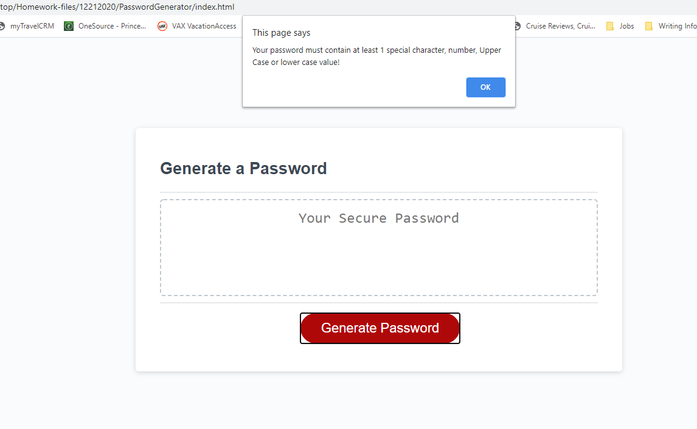
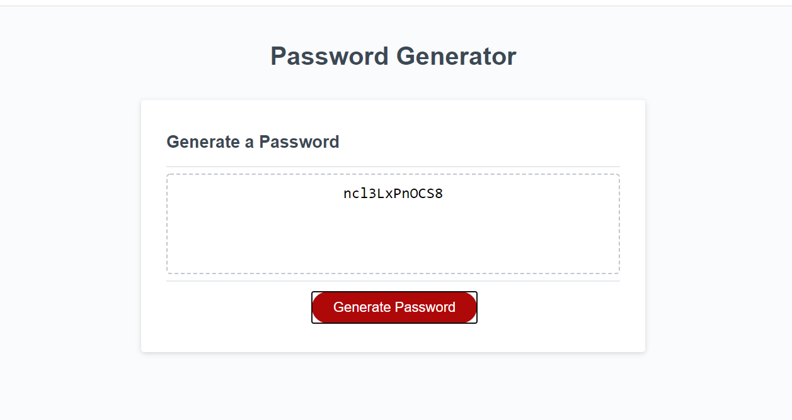

# PasswordGenerator

The URL for this Password Generator is
 https://kcnancy.github.io/PasswordGenerator/

## Table of Contents
* [Description](#description)
* [User Story](#userstory)
* [Development](#development)
* [Usage](#usage)
* [Future Enhancements](#future-enhancements)
* [Credits](#credits)
* [License](#license)

### Description

This project creates a random password generator with input from the user.

### User Story

AS AN employee with access to sensitive data
I WANT to randomly generate a password that meets certain criteria
SO THAT I can create a strong password that provides greater security

#### Acceptance Criteria
GIVEN I need a new, secure password
WHEN I click the button to generate a password
THEN I am presented with a series of prompts for password criteria
WHEN prompted for password criteria
THEN I select which criteria to include in the password
WHEN prompted for the length of the password
THEN I choose a length of at least 8 characters and no more than 128 characters
WHEN prompted for character types to include in the password
THEN I choose lowercase, uppercase, numeric, and/or special characters
WHEN I answer each prompt
THEN my input should be validated and at least one character type should be selected
WHEN all prompts are answered
THEN a password is generated that matches the selected criteria
WHEN the password is generated
THEN the password is either displayed in an alert or written to the page

### Development
The process begins when the user clicks the "Generate Password" button.

The user must provide the number of digits they would like for the password in a prompt box. If the number of digits entered is less than 8 or more than 128 the user is prompted to re-enter the length to a number within the range of 8 - 128.

Once the number of digits/characters has been validated as within range the user sees a confirmation box asking if they would like the new password to contain special characters, an OK click includes special characters, a cancel click omits special characters.

This is followed by a confirmation box asking if they would like numbers in their password, again an OK click includes numeric values in the password algorithm, cancel omits numeric values.

The next confirmation is for upper case alpha characters, click OK to include upper case alpha and cancel omits upper case alpha.

The final confirmation box asks if lower case alpha characters are desired in the password. An OK click indicates yes, and cancel click is no.

If cancel is clicked for all 4 password options the user sees an alert that informs them that they must select at least one special character, number, upper or lower case letter. After clicking OK on the alert the 4 password options are re-prompted.

Once the user has selected at least one option the new password is displayed in the text box.

### Usage
HTML, CSS, Javascript, Snip & Sketch to capture screen images.

### Future Enhancements
1. Copy new password to clipboard.
2. Clear text box when Generate Password button is clicked.

### Credits
Nancy McBride

### License
MIT License

Copyright (c) 2021 KU Boot Camp

Permission is hereby granted, free of charge, to any person obtaining a copy
of this software and associated documentation files (the "Software"), to deal
in the Software without restriction, including without limitation the rights
to use, copy, modify, merge, publish, distribute, sublicense, and/or sell
copies of the Software, and to permit persons to whom the Software is
furnished to do so, subject to the following conditions:

The above copyright notice and this permission notice shall be included in all
copies or substantial portions of the Software.

THE SOFTWARE IS PROVIDED "AS IS", WITHOUT WARRANTY OF ANY KIND, EXPRESS OR
IMPLIED, INCLUDING BUT NOT LIMITED TO THE WARRANTIES OF MERCHANTABILITY,
FITNESS FOR A PARTICULAR PURPOSE AND NONINFRINGEMENT. IN NO EVENT SHALL THE
AUTHORS OR COPYRIGHT HOLDERS BE LIABLE FOR ANY CLAIM, DAMAGES OR OTHER
LIABILITY, WHETHER IN AN ACTION OF CONTRACT, TORT OR OTHERWISE, ARISING FROM,
OUT OF OR IN CONNECTION WITH THE SOFTWARE OR THE USE OR OTHER DEALINGS IN THE
SOFTWARE.

